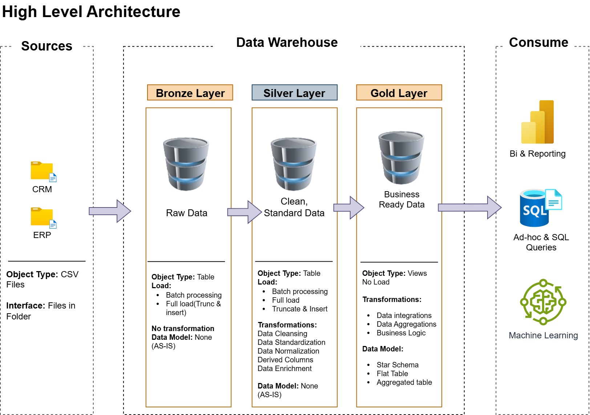

# 🧠 Modern Data Warehouse & Analytics Solution

Welcome to the **Modern Data Warehouse & Analytics Solution** repository! 🌟  
This project showcases a complete end-to-end data warehousing and analytics workflow — from raw data ingestion to generating meaningful business insights.  
It’s designed as a **portfolio project** to demonstrate **best practices in data engineering, ETL design, and analytical modeling**.

---

## 🧩 Data Architecture

The project is built on the **Medallion Architecture** framework, organized into **Bronze**, **Silver**, and **Gold** layers for scalable and maintainable data pipelines.  


1. **Bronze Layer** 🪙 — Captures raw data directly from source systems. Data is ingested from CSV files into SQL Server.  
2. **Silver Layer** ⚙️ — Cleanses, standardizes, and normalizes data to ensure quality and consistency.  
3. **Gold Layer** 🏆 — Hosts the final analytical models (Star Schema) optimized for BI dashboards and reporting.

---

## 📘 Project Overview

This repository demonstrates the **complete lifecycle** of a modern data warehouse:

1. **Data Architecture Design** — Layered Medallion-style model ensuring scalability and clarity.  
2. **ETL Pipeline Development** — Building efficient pipelines from source → Bronze → Silver → Gold.  
3. **Dimensional Modeling** — Designing fact and dimension tables for analytics.  
4. **Business Insights** — Query-driven analytics and performance dashboards.

🎯 Ideal for demonstrating expertise in:
- SQL Development  
- Data Architecture  
- ETL / ELT Pipelines  
- Data Engineering  
- Dimensional Modeling  
- Data Analytics  

---

## ⚙️ Getting Started

### 🔧 Prerequisites
To run this project locally, you’ll need:
- **Microsoft SQL Server** (or Azure SQL Database)
- **SQL Server Management Studio (SSMS)** or Azure Data Studio
- **Git** for cloning the repository
- **CSV files** for ERP and CRM datasets

### 🚀 Setup Instructions

1. **Clone the repository**
   ```bash
   git clone https://github.com/yourusername/data-warehouse-project.git
   cd data-warehouse-project
   ```

2. **Create database schemas**
   - Run the DDL scripts from `/scripts/bronze`, `/scripts/silver`, and `/scripts/gold`.
   - These scripts will create all tables and views required for each layer.

3. **Load data into the Bronze layer**
   - Execute the stored procedure:
     ```sql
     EXEC bronze.load_bronze;
     ```
   - This loads raw data from CSV files into Bronze tables.

4. **Transform data to Silver**
   - Clean and standardize the data:
     ```sql
     EXEC silver.load_silver;
     ```

5. **Build Gold analytical views**
   - Generate the business-ready data models

6. **Run validation tests**
   - Validate integrity, relationships, and uniqueness using

7. **Analyze & visualize**
   - Connect Power BI, Tableau, or another BI tool to the Gold schema for analytics.

---

## 🧱 Project Requirements

### 🎯 Objective
Build a SQL-based data warehouse that integrates multiple source systems (ERP and CRM) into a unified analytical model.

### 📋 Specifications
- **Data Sources** — Two CSV-based systems (ERP, CRM).  
- **Data Quality** — Cleansing and normalization before analysis.  
- **Integration** — Unified star schema for easy querying.  
- **Scope** — Current data only (no historization).  
- **Documentation** — Full metadata and data model documentation included.

---

## 📊 Analytics & Reporting

This phase focuses on generating key insights from the Gold layer, including:
- 🧍 Customer Behavior Analysis  
- 📦 Product and Category Performance  
- 💰 Sales Trends and Revenue Metrics  

Results are designed to feed BI dashboards and business reports.  
See [docs/requirements.md](docs/requirements.md) for more details.

---

## 🗂️ Repository Layout
```markdown
data-warehouse-project/
│
├── datasets/                           # Raw ERP and CRM datasets
│
├── docs/                               # Documentation and diagrams
│   ├── etl.drawio                      # ETL pipeline design
│   ├── data_architecture.jpg           # Architecture overview
│   ├── data_catalog.md                 # Dataset catalog and field details
│   ├── data_flow_diagram.jpg           # Data flow visualization
│   ├── data_model.jpg                  # Star schema model
│   ├── naming_conventions.md           # Standards for naming consistency
│
├── scripts/                            # SQL DDL and ETL scripts
│   ├── bronze/                         # Raw data ingestion layer
│   ├── silver/                         # Cleansing and transformation layer
│   ├── gold/                           # Analytical layer (views and models)
│
├── tests/                              # Data quality and validation scripts
│
├── README.md                           # Project guide and setup instructions
└── LICENSE                             # License details
```

---

## 🧾 License
This project is licensed under the [MIT License](LICENSE).  
You are free to **use, modify, and distribute** it with appropriate credit.

---

## 🙌 Acknowledgements
Special thanks to [DataWithBaraa](https://github.com/DataWithBaraa/sql-data-warehouse-project)  
for inspiration and foundational design ideas.  
This version has been **enhanced and restructured** for educational and portfolio purposes.
